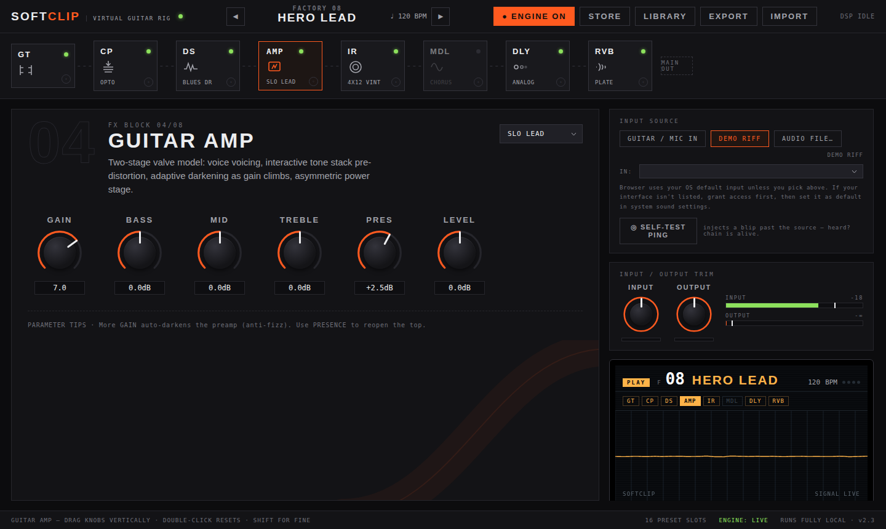

# Softclip

A virtual guitar amp and pedalboard that runs entirely in the browser, built on the Web Audio API. No build step, no server, no dependencies to install — it's three static files.

**[Try it live →](https://lucanenni.github.io/softclip/)**



## What's in the rig

A full signal chain, each block modeled rather than sampled:

- **Noise gate** and **compressor** (opto/studio/punch flavors)
- **Overdrive/distortion** — screamer, blues drive, razor, dist+, fuzz
- **Amp** — 8 voicings (Tweed, Blackface, AC Chime, Blues 30, Plexi, Roar 800, Recto Modern, Slo Lead), two-stage waveshaping with gain-dependent tone darkening and an interactive tone stack
- **Cabinet** — 8 speaker/mic profiles built from a filter network, not IRs
- **Modulation** — chorus, phaser, flanger, tremolo, vibrato, rotary
- **Delay** — digital, analog, tape (with wow & flutter), ping-pong, tempo-syncable
- **Reverb** — room, hall, plate, spring, cathedral, synthesized on the fly per decay/tone setting

Plus a chromatic **tuner**, a **drum machine** with tap tempo, 16 factory presets, a user preset library (saved to `localStorage`), JSON import/export, and a self-test ping that injects a tone past the input stage to help diagnose a silent chain.

Everything runs locally: audio never leaves the browser, and nothing is uploaded anywhere.

## Running it

Two ways:

1. Open **[the live demo](https://lucanenni.github.io/softclip/)**.
2. Or clone the repo and open `index.html` directly — no install, no build:
   ```
   git clone https://github.com/lucanenni/softclip.git
   cd softclip
   open index.html   # or just double-click it
   ```

Live guitar/mic input needs a secure context (HTTPS or `localhost`), which the demo above satisfies. The **DEMO RIFF** and **AUDIO FILE** input modes work either way, including opened straight from disk.

## Project structure

```
index.html              markup only
style.css                all styling
js/
  01-core.js              utils, storage, preset data & state
  02-audio-engine.js       the DSP: gate, comp, drive, amp, cab, mod, delay, reverb
  03-source.js             input handling — mic, demo riff, file playback
  04-ui-chain.js           signal chain, knobs, parameter panel, LCD
  05-ui-library.js         preset drawer, store/import/export
  06-tuner.js               pitch detection
  07-drums.js               drum machine, tap tempo
  08-scope-status.js        oscilloscope, meters, status bar
  09-main.js                DOM event wiring + init
```

Plain `<script>` tags, loaded in order, sharing one global scope — deliberately not ES modules, since those are blocked by CORS when a page is opened straight from disk (`file://`), which would break running this with a simple double-click.

## License

MIT — see [LICENSE](LICENSE).
